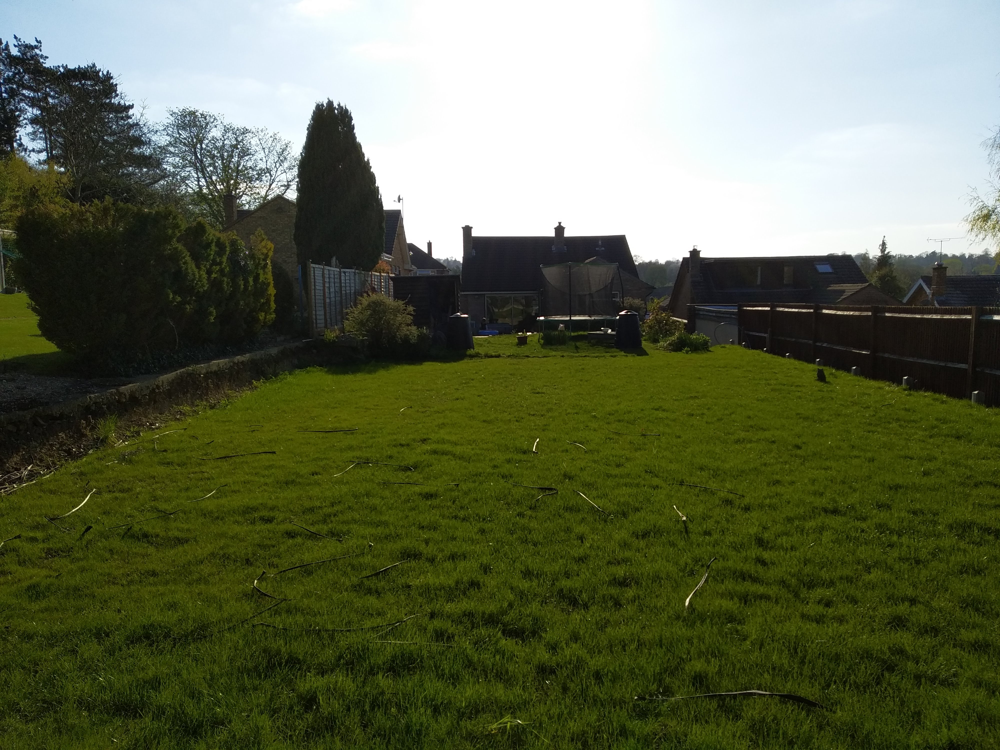
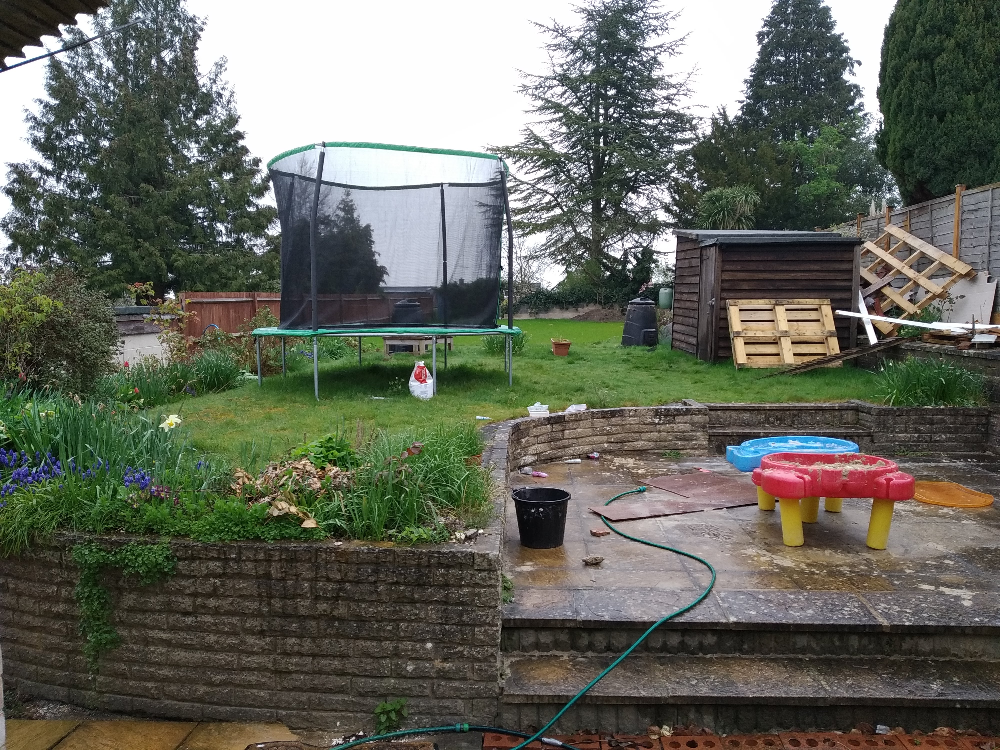
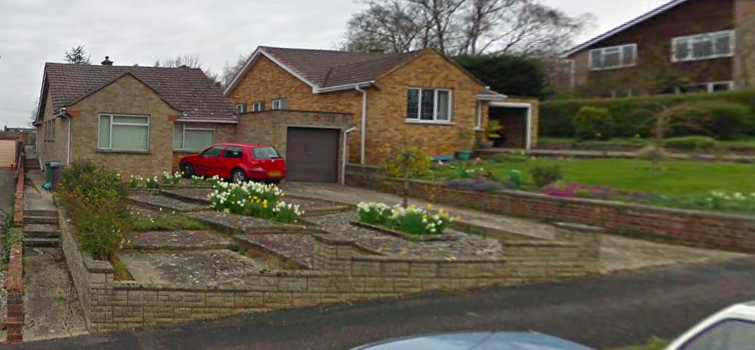

# Garden Transformation
# Table of contents
1. [Introduction](#introduction)
2. [Back Garden](#Back)
    1. [Dimensions](#BackDimensions)
    1. [Requirements](#BackRequirements)
3. [Front Garden](#Front)
    1. [Dimensions](#FrontDimensions)
    1. [Requirements](#FrontRequirements)
3. [Front Garden](#Front)
4. [Level of Service Required](#ServiceRequired)    

## Introduction 
We are looking for a landscape designer to help us get the most space and use out of our 490 square meter garden.  We have made an initial start at landscaping, but realized that without an overall plan, it quickly becomes difficult to prioritize and make decisions.

We hope that by commissioning a front and back garden design, new ideas will be suggested and specific design and material choices will be made.

A [pinterest board](https://www.pinterest.co.uk/dijk0381/trampoline/) has been created which illustrates the ideas we have.

## Back Garden 

The back garden will have a variety of uses - childrens play area, entertainment, vegetable area and space for a home office.

### Dimensions 
Area: 374.4 square meters

Width (by house): 11.35m

Width (at end of garden): 10m

Length (From dining room wall): 35.08m

We maintain the southerly boundary fence.
The northern boundary fence is maintained by our neighbours.

### Requirements 
In priority order

1. #### Southside fence/Retaining wall
1. #### Northside privacy plants
1. #### Transition from house to garden i.e. how to manage/present height change
1. #### Surface drainage channels for roof rain water away from house
1. #### Child climbing frame + Wendy house
1. #### Sunken Trampoline
1. #### Flower beds
1. #### Raised garden beds
1. #### Patio/Entertaining area
1. #### Tool Shed
1. #### Green House
1. #### Illuminated Garden Path
1. #### Firewood storage for house fireplace
1. #### BBQ area
1. #### Water/electricity lines
1. #### Garden Office

## Front Garden 

This area will mainly be used for car/bike parking and making the house presentable.

### Dimensions 
Area: 115 square meters

Width: 12.5m

Length (from bedroom): 9.2m

### Requirements 
In priority order

1. #### Surface drainage of roof rain water
1. #### Car parking
1. #### Grass area + fruit tree
1. #### Northside retaining wall
1. #### Secure covered bike storage

## Level of Service Required 
The design plan would include:
1. Areas that need to be leveled/landscaped
2. Placement of all the structures
3. Construction type and materials to be used for fences and retaining wall
4. Construction type and materials to be used for pathways and entertaining areas
5. Type of plants/flowers to use & grass to sow
6. Advice on DIY friendly materials/construction methods
